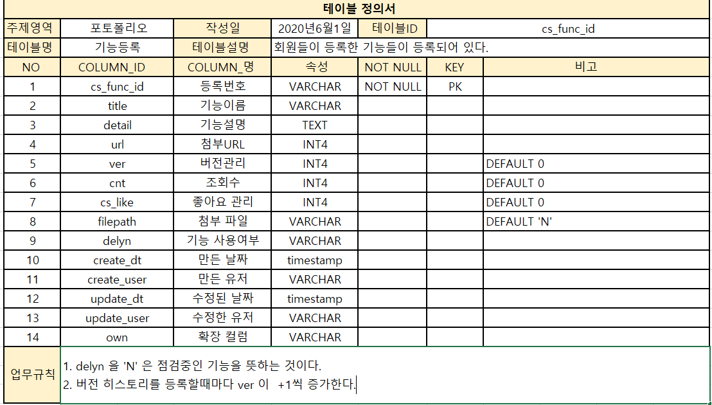
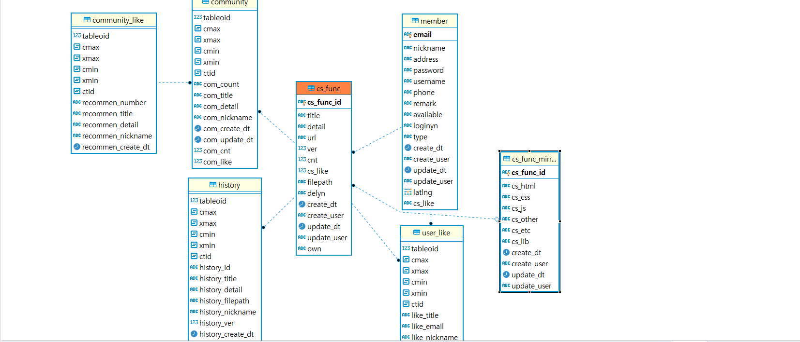
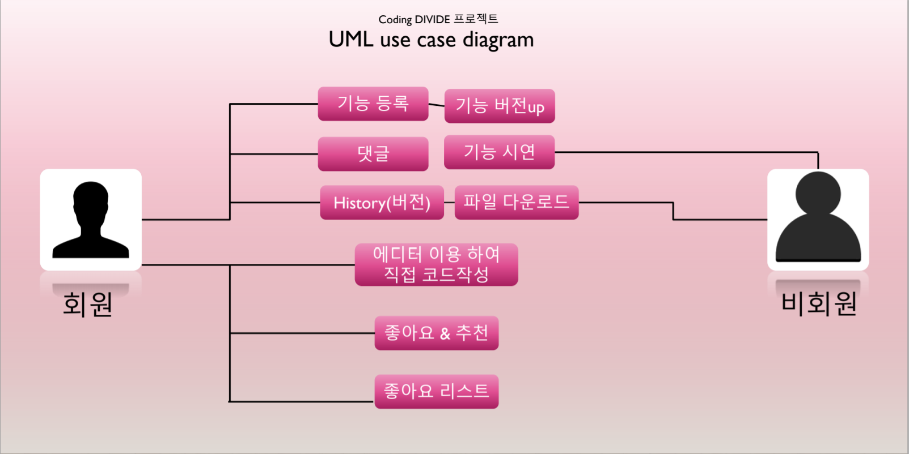

# 개요
● 프로젝트명 : divide

● 일정 : 2020.6.1 ~ 2020.07.1

● 팀구성 : 유영규

● 목적 : 사용자가 사용할 수 있는 기능들을 다른 사용자와 공유할 수 있는 프로젝트이다.
   
    ○ 에디터 라이브러리 사용

    ○ 내가 에디터로 직접 기능들을 구현할 수 있으며, 만들어져 있는 URL첨부로
      공유할 수 있는 방법2가지로 나뉘어진다.

● 사용기술 및 개발환경
        ○ O/S : Windows 10(개발환경) 

        ○ Server : Tomcat8.5

        ○ DB : PostgreSQL

        ○ Pramework : Spring boot, Jquery, mybatis

        ○ Programming Language : JAVA, HTML, Javascript, CSS
        
        ○ Tool : Eclipse

# 목적
● 내가 사용할 수 있는 기능들을 다른 사람들과 공유하고자 생성된 프로젝트

● 다른 오픈소스를 과져와 나에게 맞게 응용할 수 있는 분석력을 기르도록 하자.

ex) codepen.io 같은 오픈 에디터 소스

# 기획 
● 내가 사용할 수 있는 기능들을 다른 사람들과 공유할 수 있도록 구현

● 이미 만들어진 기능들을 url만 있으면 공유할 수 있도록 구현

# 프로젝트 주요 기능
● 회원가입 및 로그인, 로그아웃 기능 

● 기능 게시글 open , 점검중 으로 관리 하는 기능

● 게시글 작성, 수정, 삭제 

● 댓글 기능 및 좋아요 및 추천 기능 

● 직접 에디터에 코드 작성하는 기능 

● imrame 창으로써 기능 시연 

# 사용 기술 
● Spring boot, Mybastis, java, javascript, jquery, PostgreSQL

# 기술적인 문제 해결 과정

● 부족한 지식은 구글링을 통한 지식획득

● 미숙한 응용력은 다양한 방법으로 시도함으로써의 응용력 향상

# DBtable 정의서

# DBdiagrame

# USECASE 

● 회원 :
         ● 기능 게시글을 작성, 수정, 점검중 으로 할 수 있다.
         ● 등록한 기능게시글에 나의 기능을 URL첨부, 직접 에디터 작성 둘중 1가지 방법으로 첨부 가능하다.
         ● 마음에 드는 기능을 좋아요를 누를 수 있다.
         ● 좋아요누른 List를 볼수 있다.
         ● 회원들이 작성한 기능 시연 가능하다.

● 비회원 : 
         ● 회원들이 작성한 기능들을 시연해볼 수 있다.
         ● 게시글 관람 가능하다.

